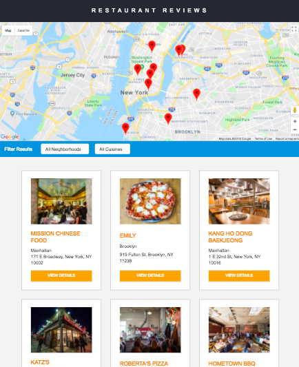

# Restaurant Reviews App

This project is part of the Udacity Front-End Nanodegree. 

## Project Overview:

In this project, a static webpage is converted to a mobile-ready web application. That includes, converting the design to be responsive on different sized displays and accessible for screen reader use. A service worker is also added to cache the data for the website so that any page that has been visited is accessible offline.

## How to run the application

1. Download or clone this repository.
2. From inside the new directory, launch a local client server using Python from your terminal. To check the version of Python you have type in your terminal `python -V`.
    - If you have Python 2.x, spin up the server with `python -m SimpleHTTPServer 8000` (or some other port, if port 8000 is already in use.) 
    - If you have Python 3.x, you can use `python3 -m http.server 8000`.
    - If you don't have Python installed, navigate to Python's [website](https://www.python.org/) to download and install the software.
3. Visit the site in your browser at http://localhost:8000.

## Credits

The starter code is from [Udacity](https://github.com/udacity/mws-restaurant-stage-1).

## License

MIT License

Copyright (c) 2018 Lucia Gonzalez Moscoso

Permission is hereby granted, free of charge, to any person obtaining a copy of this software and associated documentation files (the "Software"), to deal in the Software without restriction, including without limitation the rights to use, copy, modify, merge, publish, distribute, sublicense, and/or sell copies of the Software, and to permit persons to whom the Software is furnished to do so, subject to the following conditions:

The above copyright notice and this permission notice shall be included in all copies or substantial portions of the Software.

THE SOFTWARE IS PROVIDED "AS IS", WITHOUT WARRANTY OF ANY KIND, EXPRESS OR IMPLIED, INCLUDING BUT NOT LIMITED TO THE WARRANTIES OF MERCHANTABILITY, FITNESS FOR A PARTICULAR PURPOSE AND NONINFRINGEMENT. IN NO EVENT SHALL THE AUTHORS OR COPYRIGHT HOLDERS BE LIABLE FOR ANY CLAIM, DAMAGES OR OTHER LIABILITY, WHETHER IN AN ACTION OF CONTRACT, TORT OR OTHERWISE, ARISING FROM, OUT OF OR IN CONNECTION WITH THE SOFTWARE OR THE USE OR OTHER DEALINGS IN THE SOFTWARE.

